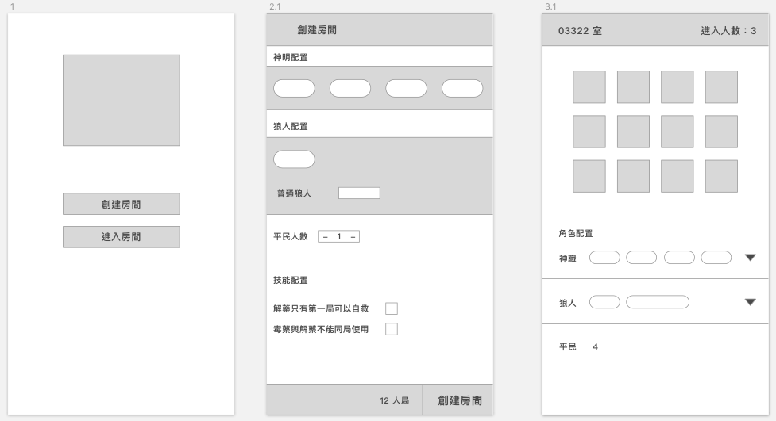

## werewolf (狼人殺面殺小工具)

### Wireframe



### [Flow](https://drive.google.com/file/d/1PPYfuUqZHvPN8MbPxmKuEjYqoFRcVxcM/view?usp=sharing)
- 建立房間/選擇遊戲人員配置
- 以房間密碼快速加入房間
- 遊戲流程實作（天黑、天亮）
- 遊戲結束判斷（好人陣營、壞人陣營全滅）
- 遊戲技能啟動（預言家、女巫、騎士、獵人）


### Technologies Used
- vue2.6、vue-router3、vuex3
- php7、laravel 6.0
- pusher (websocket服務)
- mysql5.7
- redis

## Setup

This project uses the following tools. Go check them out if you don't have them locally installed.

- [node](https://nodejs.org/en/)
- [composer](https://getcomposer.org/)
- [redis](https://redis.io/)
- [mysql](https://www.mysql.com/)

Please register [pusher](https://pusher.com/), and create a [channel](https://pusher.com/channels) project

```
npm install && npm run prod
composer install
cp .env.example .env
# fill mysql-connection-setting into .env
# fill pusher-channel-setting into .env

php artisan key:generate
php artisan migrate
php artisan db:seed
```

## Usage

start web-service

```
php artisan serve
```

start redis-server

```
redis-server
```

start queue-runner

```
php artisan queue:work
```

## Contributing

PRs accepted.

1. Fork it!
2. Create your feature branch: `git checkout -b my-new-feature`
3. Commit your changes: `git commit -am 'Add some feature'`
4. Push to the branch: `git push origin my-new-feature`
5. Submit a pull request :D

## Author
- Email：b10303008@gmail.com